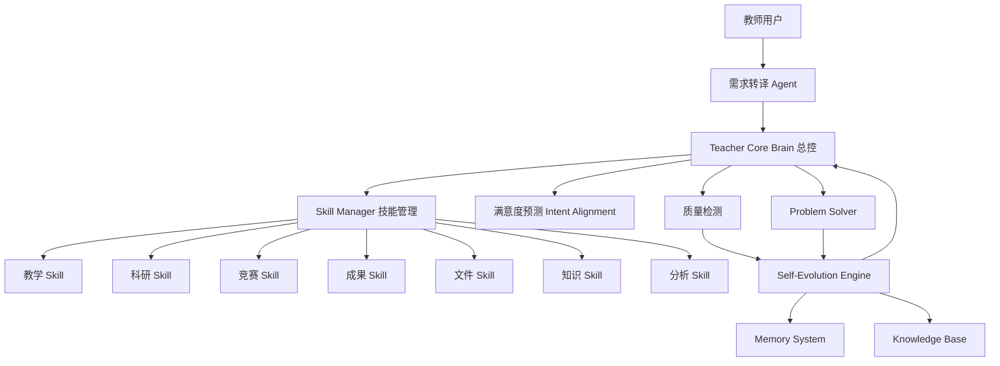

# 教师大脑架构设计 V1.0

日期：2026-08-01    依据：《00_Master需求文档.md》

## 一、系统架构图



## 二、Agent模块划分

| 模块 | 职责 | 现有落点 |
|---|---|---|
| Teacher Core Brain | 总控状态机、任务调度 | core/orchestrator.py |
| Requirement Transfer | 意图理解、任务拆解 | core/translator.py |
| Intent Alignment | 满意度预测 | core/intent_alignment.py |
| Skill Manager | 能力注册与调度 | capabilities/ + router_agent |
| 教学 Skill | 课程建设与资源生产 | CourseAgent/Skill 教案/课标/计划 |
| 科研 Skill | 教改课题、论文 | capabilities/research.py |
| 竞赛 Skill | 比赛方案、讲稿、答辩 | capabilities/competition.py |
| 成果 Skill | 软著、专利交底 | capabilities/achievements.py |
| 文件 Skill | 文档工程与检测 | modules/（writer/checkers/packager） |
| 知识 Skill | 知识更新 | core/knowledge_update.py |
| 分析 Skill | 五维诊断 | core/excellence_engine.py |
| Problem Solver | 问题原因→方案→验证 | core/problem_solver.py |
| Self-Evolution | 规则升级、成长评分 | core/evolution.py + tools/ |
| Memory | 经验记忆、用户模型 | core/memory.py + core/user_model.py |

## 三、Skill体系设计

每个 Skill 单元统一六件套：

| 组件 | 说明 | 现有实现示例 |
|---|---|---|
| 执行器 | 完成任务 | modules/document_writer.py、capabilities/* |
| 评价器 | 判断质量 | reviewer + format/content checkers |
| 反思器 | 分析不足 | learner、evolution.record_outcome |
| 优化器 | 调整方法 | repair + escalation |
| 经验库 | 保存案例 | memory（successes/failures/solutions） |
| 进化器 | 升级能力 | evolution + upgrade_review |

## 四、数据结构设计

### TaskSpec
```json
{"id": "T-xxx", "intent": "optimize", "domains": ["课程标准"], "deliverables": ["课程标准"],
 "quality": "excellent", "constraints": [], "compute_hint": ["高算力"], "confidence": 0.95}
```

### Task
```json
{"id": "T-xxx", "spec": {}, "status": "DONE", "steps": ["TRANSLATED","PLANNED","EXECUTING","REVIEWING","PACKAGED","LEARNED"], "trace": []}
```

### MemoryEntry
```json
{"id": "failures-3", "namespace": "failures", "time": "2026-08-01 00:00:00", "payload": {}}
```

### SkillUnit
```json
{"name": "教案Skill", "executor": "document_writer", "evaluator": "reviewer",
 "reflector": "learner", "optimizer": "repair", "experience_ref": "memory/successes",
 "evolution_hook": "evolution.controlled_upgrade"}
```

### Rule / UpgradeProposal / KnowledgeUpdate / GrowthReport / UserModel
```json
{"Rule": {"id": "R-1", "level": "L1", "text": "", "approval": "auto", "version": 1}}
{"UpgradeProposal": {"id": "U-1", "level": "L2", "problem": "", "solution": "", "status": "pending_verify"}}
{"KnowledgeUpdate": {"domain": "政策", "title": "", "summary": "", "impact": "", "status": "imported"}}
{"GrowthReport": {"score": 62, "capabilities": {}, "memory_stats": {}, "issues": [], "suggestions": []}}
{"UserModel": {"preferences": {}, "stats": {}, "feedback": []}}
```

## 五、开发路线图

| 阶段 | 内容 | 状态 |
|---|---|---|
| P1 教师大脑底座 | 总控、需求转译、记忆、自我进化 | ✅ 已完成 |
| P2 Skill Manager与Skill六件套 | 将现有模块Skill化，统一执行/评价/反思/优化/经验/进化 | ✅ 完成（skill_factory注册7个Skill，审计通过） |
| P3 教学与精品模块深化 | 资源生产+五维诊断+自动提升 | 🟡 主体完成 |
| P4 科研Skill | 教改课题、论文、专业科研 | 🟡 基础完成 |
| P5 竞赛Skill | 比赛方案、讲稿、答辩、学生竞赛 | 🟡 基础完成 |
| P6 成果Skill | 软著、专利、教学成果奖 | 🟡 基础完成 |
| P7 知识更新与数字孪生 | 联网监测、用户长期模型、成长评分上线 | 🟡 接口+离线降级监测+用户画像完成；实际联网运行待环境放行 |

## 六、实施原则

先大脑、后Skill；所有Skill必须六件套闭环；升级必须可控；算力必须自适应；资源扩展与知识联网更新按确认顺序推进。
