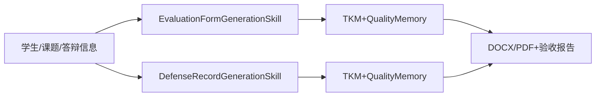

```mermaid
graph LR
  A[学生/课题/答辩信息] --> B[EvaluationFormGenerationSkill]
  A --> C[DefenseRecordGenerationSkill]
  B --> D[TKM+QualityMemory]
  C --> E[TKM+QualityMemory]
  D --> F[DOCX/PDF+验收报告]
  E --> F
```
