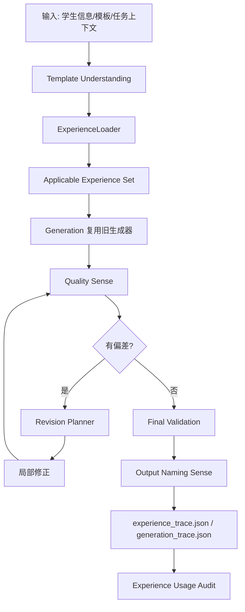
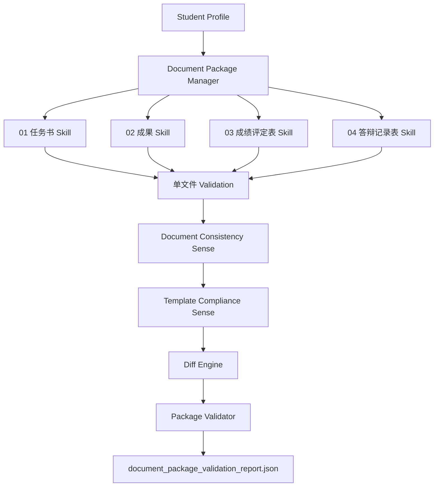

# Experience Integration Layer 调用流程图

版本：0.7-eil-flow-v1

## 一、总体流程



## 二、Result Agent 调用流程

```text
学生成果初稿
 ↓
Result TKM（结构理解）
 ↓
Result Quality Memory + Golden Case（规划约束）
 ↓
result_reference_builder（复用，不修改）
 ↓
内容层检查 + 格式层检查 + 引用层检查（Reference Quality Sense）
 ↓
Revision Planner（最小局部修正）
 ↓
Final Validation + Output Naming Sense
 ↓
双 Trace + Usage Audit
```

## 三、模板驱动型文档调用流程（成绩评定表/答辩记录表）

```text
模板 + 学生信息
 ↓
TKM 解析（表格/字段/区域）
 ↓
Quality Memory 加载
 ↓
模板填充（run级，样式继承）
 ↓
Table Structure / Region / Character Style Sense
 ↓
Revision Planner
 ↓
Validation + Output Naming Sense
 ↓
双 Trace + Usage Audit
```

## 四、文档包级调用流程

