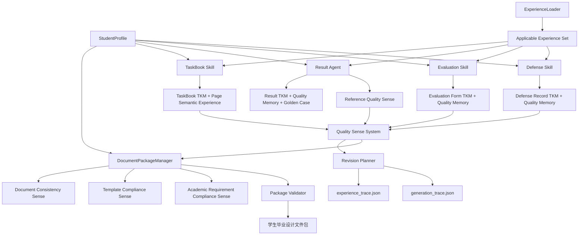

# CourseAgent V0.7 Document Intelligence Production Architecture Design

版本：0.7-arch-v1
状态：设计稿（未编码）
目标：解决 `knowledge_isolated=true`，从“单文件生成”升级为“整套学生档案可交付”
原则：不破坏 V0.3/V0.4/V0.6；新能力默认关闭；先设计审查再实施；经验调用必须有真实证据

## 一、总体架构调整方案

```text
Student Profile（唯一数据源）
        ↓
Document Package Manager
        ↓
ExperienceLoader
        ↓
Applicable Experience Set
        ↓
Skill Runner（task_book / result / evaluation / defense）
  ├── Template Understanding
  ├── Experience Loading
  ├── Generation Planning
  ├── Generation（复用旧生成器，不修改）
  ├── Quality Sense
  ├── Revision Planner
  └── Validation
        ↓
单文件 Trace
        ↓
Document Package Validator
  ├── Document Consistency Sense
  ├── Template Compliance Sense
  ├── Academic Requirement Compliance Sense
  └── 交付完整性检查
        ↓
可直接提交的毕业设计文件包
```

- 新增 V0.7 能力层，默认关闭：`experience_integration_enabled=false`；
- 关闭后完全回退旧流程；
- 旧生成器只被 Runner 调用，不被修改。

## 二、模块关系图



## 三、数据流设计

```text
学生信息 JSON + 模板 + 任务上下文
 ↓
StudentProfile（标准化唯一主数据）
 ↓
DocumentPackageManager（创建学生档案包目录）
 ↓
ExperienceLoader → Applicable Experience Set
 ↓
各 Skill Runner 依次执行：
   模板理解 → 经验加载 → 生成规划 → 生成 → 质量检查 → 修正 → 验证
 ↓
experience_trace.json / generation_trace.json（代码自动写入）
 ↓
包级检查：
   文件完整 → 命名 → 信息一致 → 模板符合 → 学院规范 → PDF 可打开
 ↓
document_package_validation_report.json
```

数据规则：

- StudentProfile 是所有身份字段的唯一来源；
- Trace 由代码在对应节点写入，禁止生成器手写“已使用”声明；
- 单文件 Sense 与包级 Sense 分开记录。

## 四、接口设计

### ExperienceLoader

```python
class ExperienceLoader:
    def load(self, document_type, template, task_context) -> ApplicableExperienceSet: ...
```

输出包含：经验 id、名称、来源文件、状态、适用范围、判断依据、解决策略、作用阶段。

### Skill Runner 统一接口

```python
class BaseSkillRunner:
    def run(self, profile, template, task_context) -> RunResult: ...
```

RunResult 必须包含 document_type、skill、template_source、experience_trace、generation_trace、quality_checks、revision_actions、final_validation。

### Quality Sense 统一接口

```python
class BaseSense:
    def check(self, docx_path, pdf_path, knowledge) -> SenseResult: ...
```

状态：pass / fail / degraded / unknown。

### Revision Planner

```python
class RevisionPlanner:
    def plan(self, sense_results, experience_set) -> RevisionPlan: ...
```

只做最小局部修正，并记录修正依据。

### Student Profile

```json
{
  "school": "",
  "college": "",
  "major": "",
  "class": "",
  "student_name": "",
  "student_id": "",
  "advisor": "",
  "topic": ""
}
```

### Template Diff Engine

```python
class TemplateDiffEngine:
    def compare(self, template_path, generated_path) -> TemplateDiffReport: ...
```

### Package Validator

```python
class PackageValidator:
    def validate(self, package) -> PackageValidationReport: ...
```

### ARKM Loader

```python
class AcademicRequirementLoader:
    def load(self, college_rules, school_rules, scoring_standard) -> AcademicRequirementKnowledgeModel: ...
```

## 五、Experience 调用流程

| 文档类型 | 必须加载的经验 |
|---|---|
| 任务书 | TaskBook TKM、Page Semantic Layout Experience、Document Quality Sense |
| 成果 | Result TKM、Result Quality Memory、Reference Quality Sense、Golden Case Experience、Document Quality Sense |
| 成绩评定表 | Evaluation Form TKM、Evaluation Quality Memory |
| 答辩记录表 | Defense Record TKM、Defense Quality Memory |

每次调用必须写 `experience_trace.json`：

```json
{
  "experience_id": "",
  "name": "",
  "source_file": "",
  "loaded_at": "",
  "applicable_scope": [],
  "phase": "planning | content | quality | revision | validation",
  "impact": ""
}
```

## 六、Document Package 设计

目录：

```text
06_输出成果/专业方向/学生姓名_毕业设计完整成果包/
├── 01 学生姓名 毕业设计任务书 课题名称.docx
├── 02 学生姓名 毕业设计成果 课题名称.docx
├── 03 学生姓名 毕业设计成绩评定表 课题名称.docx
├── 04 学生姓名 毕业设计答辩记录表 课题名称.docx
└── _过程记录/
```

Package Validator 检查：

- 文件完整；
- 命名规范；
- 信息一致；
- 模板正确；
- PDF 正常；
- 无隐藏错误。

## 七、Quality Sense 体系设计

### 单文件 Sense

- Template Consistency Sense：表格、行列、合并、页面与模板一致；
- Table Structure Sense：表格结构未被破坏；
- Region Integrity Sense：签字、评价、结论、记录区域完整；
- Character Style Sense：字体、字号、加粗、斜体、样式继承；
- Page Semantic Sense：语义单元同页，禁止关键区域拆分；
- Reference Quality Sense：文献数量、连续编号、隐藏字符、网页污染、悬挂缩进、首行/续行对齐；
- Output Naming Sense：文件名、目录、编号、学生隔离。

### 包级 Sense

- Document Consistency Sense：跨文档身份与课题一致；
- Template Compliance Sense：生成文件符合学校模板；
- Academic Requirement Compliance Sense：符合学院内容、结构、格式、质量要求。

### 状态语义

- pass：通过；
- fail：必须修正；
- degraded：组件不可用，输出 unknown，不误判通过/失败。

## 八、Result Agent 专项

成果是 Content-driven Document，独立处理：

### 内容层

- 章节结构；
- 技术路线；
- 专业逻辑；
- 任务匹配。

### 格式层

- 标题层级；
- 目录；
- 页码；
- 图表；
- 分页。

### 引用层

- 文献数量；
- 连续编号；
- 隐藏字符；
- 网页污染；
- 悬挂缩进；
- 首行与续行对齐。

## 九、Academic Requirement Compliance Sense（ARKM）

### 数据来源

- 学院毕业设计文件；
- 学校规范；
- 评分标准。

### ARKM 结构

- content：摘要、关键词、目录、正文、结论、参考文献；
- structure：章节要求；
- format：字体、页数、格式；
- quality：优秀成果标准。

### 检查输出

- 每条要求：满足 / 不满足 / 待人工确认；
- 违规项进入 revision 或人工会审，不自动改内容。

## 十、Template Diff Engine

对比维度：

- 结构：表格数量、行列、合并单元格；
- 样式：字体、字号、加粗、对齐、行距；
- 页面：页数、区域位置、签字区域。

允许变化：学生姓名、学号、班级、课题名称等动态字段。
禁止变化：表格破坏、签字区域消失、页面语义破坏、样式异常。

输出：template_diff_report.json。

## 十一、经验系统原则

经验只记录判断逻辑，不记录单案例数字：

- 错误示例：参考文献必须 420 twips；
- 正确示例：
  - 问题：多行参考文献续行未形成悬挂关系；
  - 判断：首行与续行视觉偏移异常；
  - 策略：依据模板样式调整悬挂缩进；
  - 验证：视觉一致。

## 十二、风险分析

| 风险 | 等级 | 对策 |
|---|---|---|
| 伪调用 | 高 | Trace 代码写入 + Experience Usage Audit 门禁 |
| 单案例经验过拟合 | 高 | 经验进入注册表前必须多案例验证 |
| 旧链路被污染 | 高 | Runner 只读调用旧生成器 |
| 跨文档身份不一致 | 高 | StudentProfile 唯一数据源 |
| 模板版本混用 | 高 | Template Compliance Sense 登记版本来源 |
| 学院要求误判 | 中 | ARKM 只标记，不自动改内容 |
| Word 目录/页码不稳定 | 中 | finalization 失败降级为人工会审 |
| 开关误开 | 中 | 默认 false + 回归测试 |

## 十三、实施顺序与后续编码路线

| 阶段 | 内容 | 验收 |
|---|---|---|
| P1 | ExperienceLoader + 双 Trace 系统 | 任何生成任务输出真实 experience_trace.json |
| P2 | Document Package 基础模型 + StudentProfile | 包目录与学生主数据唯一 |
| P3 | Result Agent 接入 | 成果五项经验真实加载，问题收敛 |
| P4 | TaskBook Skill 接入 | 页面语义经验进入生成 |
| P5 | Evaluation + Defense Skill 接入 | 模板驱动文档统一 Runner |
| P6 | Academic Requirement Compliance Sense | ARKM 加载并输出合规报告 |

每阶段独立验证，通过后保持开关关闭，等待人工启用。

## 十四、最终验收标准

1. 经验真实调用，而不是报告声明；
2. 生成过程可追溯；
3. 单文件质量可控；
4. 多文件信息一致；
5. 符合模板；
6. 符合学院要求；
7. 最终输出是一套可直接提交的毕业设计文件包。

## 十五、边界与禁止事项

- 不修改 V0.3/V0.4/V0.6；
- 新能力默认关闭；
- 不自动固化经验；
- 不自动修改 Skill/Prompt/长期知识；
- 本阶段只设计，不编码。